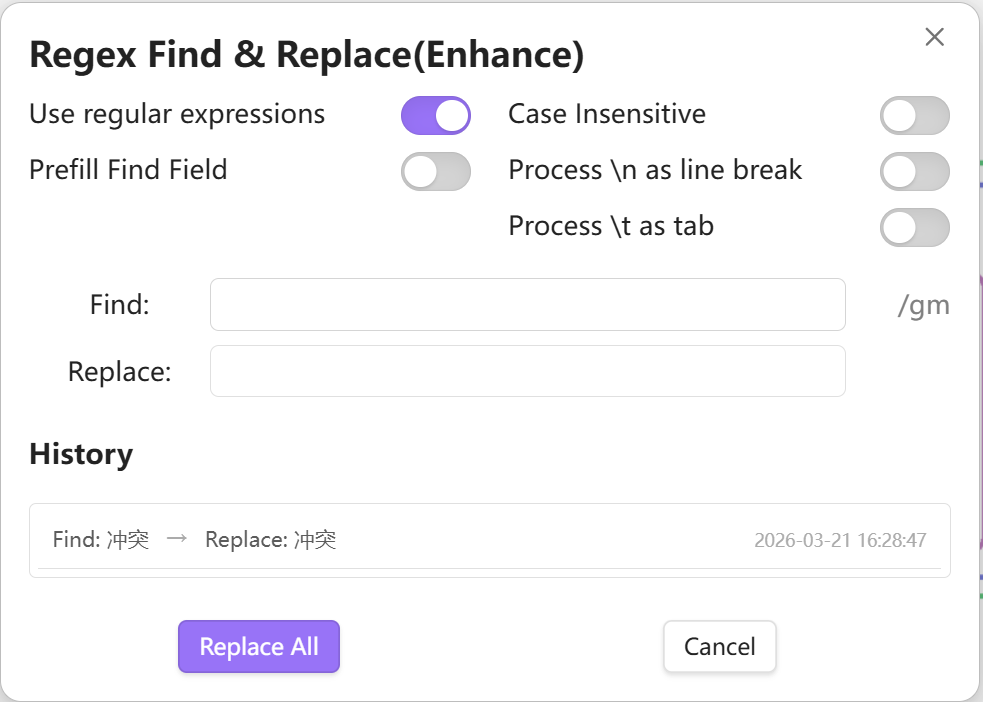
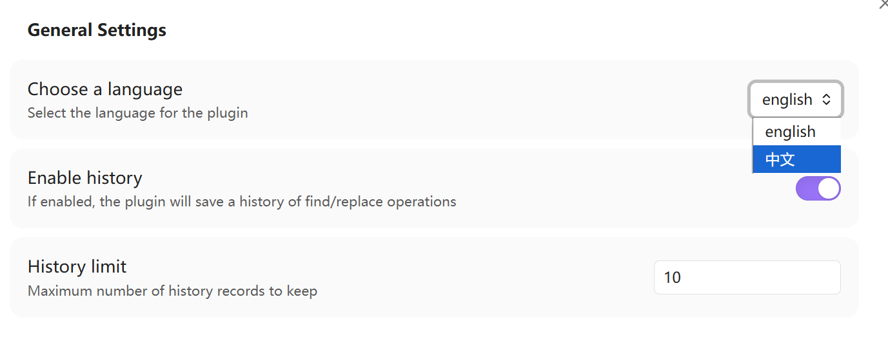
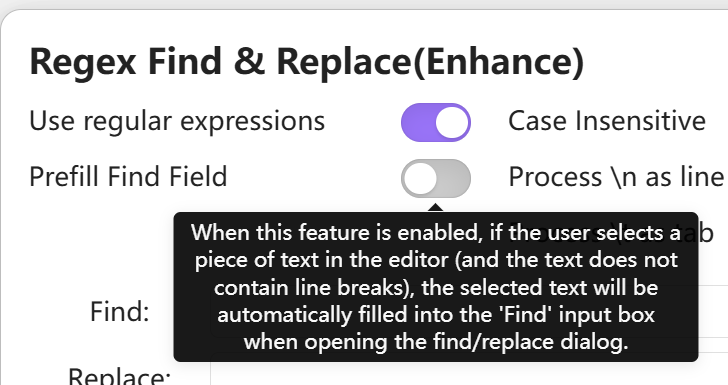

# Obsidian Plugin - Regex Find & Replace(enhance)
>This plugin is based on the [Gru80/obsidian-regex-replace](https://github.com/Gru80/obsidian-regex-replace) project, with enhanced functionality.

>Chinese document: [中文文档](README.md)

## Features

### Original Features

- Provides a dialog to find and replace text in the currently opened note
- Use regular expressions or plain text
- Replace matches in the currently selected text or the entire document

### New Features

- English/Chinese interface switching
- Keep history records for easy reuse of previous find/replace patterns
- Mouse hover over "toggle switches" for feature descriptions

## Interface Display





## How to use
- Run `Regex Find & Replace(enhance): Find and Replace using regular expressions` from the command palette or
- Assign a shortcut key to this command and use it to open the dialog
- The plugin will remember the last recent search/replace terms as well as the settings

## How to install
### From inside Obsidian
This plugin can be installed via the `Community Plugins` tab in the Obsidian Settings dialog:
- Disable Safe Mode (to enable community plugins to be installed)
- Browse the community plugins searching for "Regex Find & Replace(enhance)"
- Install the Plugin
- Enable the plugin after installation

### Manual installation
The plugin can also be installed manually from the repository:
- Create a new directory in your vaults plugins directory, e.g.   
   `.obsidian/plugins/obsidian-regex-replace`

- Head over to https://github.com/Gru80/obsidian-regex-replace/releases

- From the latest release, download the files
   - main.js
   - manifest.json
   - styles.css

  to your newly created plugin directory
- Launch Obsidian and open the Settings dialog
- Disable Safe Mode in the `Community Plugins` tab (this enables community plugins to be enabled)
- Enable the new plugin

## Project Code Structure

```
src/
├── lang/
│   ├── en.ts          # English translation
│   ├── index.ts       # Language index
│   └── zh.ts          # Chinese translation
├── types/
│   ├── HistoryItemInterface.ts          # History item interface
│   ├── LanguageTranslationInterface.ts  # Language translation interface
│   └── SettingsInfoInterface.ts         # Settings info interface
└── main.ts            # Main file
```

## How to Add New Language

To add a new language support for the plugin, follow these steps:

1. **Create language file**: Create a new language file in the `src/lang/` directory, for example `fr.ts` (French)

2. **Implement language interface**: In the newly created language file, implement the `LanguageTranslationInterface` interface, ensuring all required text fields are included

3. **Define translation content**: Define translation content following the same structure as existing language files, ensuring all required text is included

4. **Update language type enum**: In the `src/lang/index.ts` file, add the new language type to the `languageType` enum

5. **Add language to language pack**: In the `src/lang/index.ts` file, add the new language translation pack to the `languages` object

6. **Import new language file**: Import the newly created language file in the `src/lang/index.ts` file

Example:

```typescript
// Add new language in src/lang/index.ts
import fr from './fr';

export enum languageType {
    en = 'english',
    zh = '中文',
    fr = 'Français'  // Add French
}

const languages: Record<languageType, LanguageTranslationInterface> = {
    [languageType.en]: en,
    [languageType.zh]: zh,
    [languageType.fr]: fr  // Add French translation pack
};
```

After completing the above steps, the plugin will support the newly added language, and users can select to use it in the settings.
 