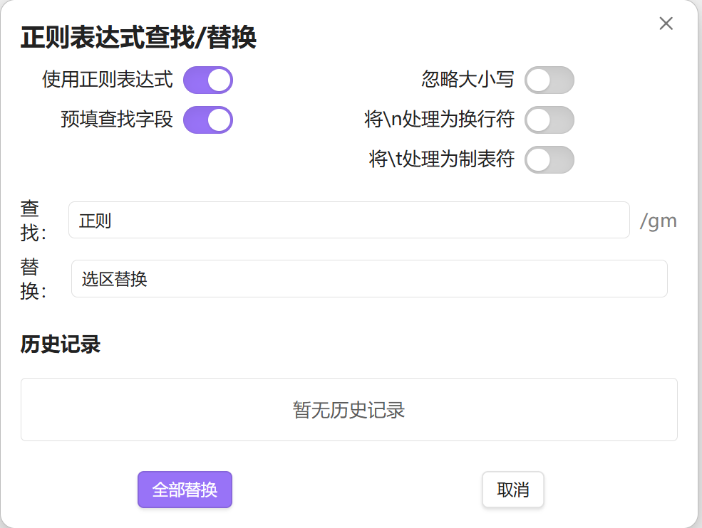
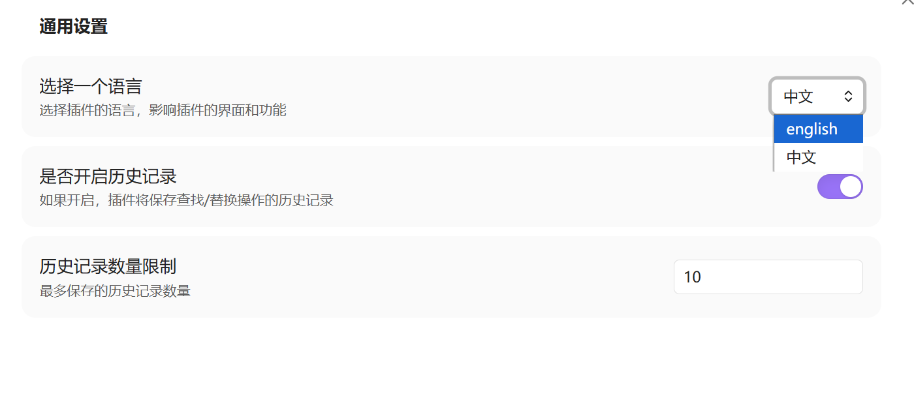
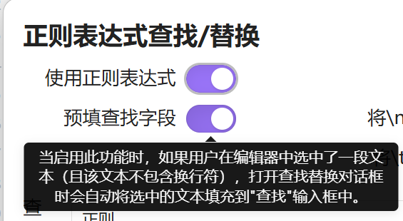

# Obsidian 插件 - 正则查找替换（增强版）
>本插件基于 [Gru80/obsidian-regex-replace](https://github.com/Gru80/obsidian-regex-replace) 项目开发，在其基础上进行了功能增强。


>英文文档：[English document](README-en.md)
## 功能

### 原有功能

- 提供一个对话框，用于在当前打开的笔记中查找和替换文本
- 使用正则表达式或纯文本查找
- 在当前选中文本或整个文档中替换匹配内容

### 新增功能

- 中英文界面切换
- 保留历史记录，方便重复使用之前的查找/替换模式
- 鼠标悬浮“切换开关”上面会有功能介绍

## 界面展示




## 使用方法
- 在命令面板中运行「正则查找/替换：使用正则表达式进行查找替换」
- 或为该命令分配快捷键，通过快捷键打开对话框
- 插件会自动记住最近使用的查找/替换内容及相关设置

## 安装方法
当前未上架商店，只能通过代码仓库手动安装：
- 在你的仓库插件目录中新建文件夹，例如：
  `.obsidian/plugins/obsidian-regex-replace-enhance`
- 访问 https://github.com/Gru80/obsidian-regex-replace/releases
- 从最新版本中下载以下文件：
  - main.js
  - manifest.json
  - styles.css
  并放入新建的插件文件夹
- 启动 Obsidian 并打开设置界面
- 在「社区插件」中关闭安全模式
- 启用该新插件

## 项目代码结构

```
src/
├── lang/
│   ├── en.ts          # 英文翻译
│   ├── index.ts       # 语言索引
│   └── zh.ts          # 中文翻译
├── types/
│   ├── HistoryItemInterface.ts          # 历史记录项接口
│   ├── LanguageTranslationInterface.ts  # 语言翻译接口
│   └── SettingsInfoInterface.ts         # 设置信息接口
└── main.ts            # 主文件
```

## 如何新增语言

要为插件新增支持的语言，请按照以下步骤操作：

1. **创建语言文件**：在 `src/lang/` 目录下创建新的语言文件，例如 `fr.ts`（法语）

2. **实现语言接口**：在新创建的语言文件中，实现 `LanguageTranslationInterface` 接口，确保包含所有需要翻译的文本字段

3. **定义翻译内容**：按照与现有语言文件相同的结构定义翻译内容，确保包含所有需要翻译的文本

4. **更新语言类型枚举**：在 `src/lang/index.ts` 文件中，在 `languageType` 枚举中添加新的语言类型

5. **添加语言到语言包**：在 `src/lang/index.ts` 文件中，在 `languages` 对象中添加新的语言翻译包

6. **导入新语言文件**：在 `src/lang/index.ts` 文件中导入新创建的语言文件

示例：

```typescript
// 在 src/lang/index.ts 中添加新语言
import fr from './fr';

export enum languageType {
    en = 'english',
    zh = '中文',
    fr = 'Français'  // 新增法语
}

const languages: Record<languageType, LanguageTranslationInterface> = {
    [languageType.en]: en,
    [languageType.zh]: zh,
    [languageType.fr]: fr  // 添加法语翻译包
};
```

完成以上步骤后，插件将支持新添加的语言，用户可以在设置中选择使用该语言。

